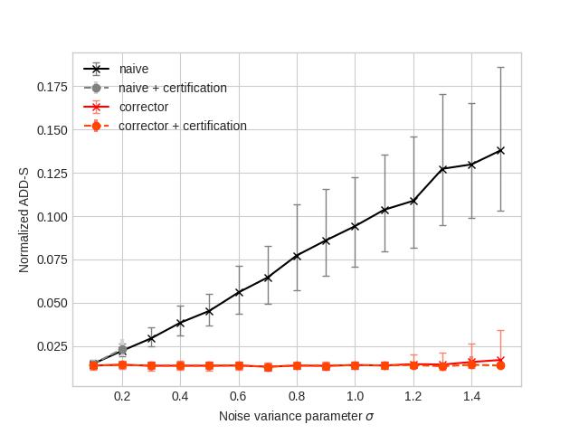
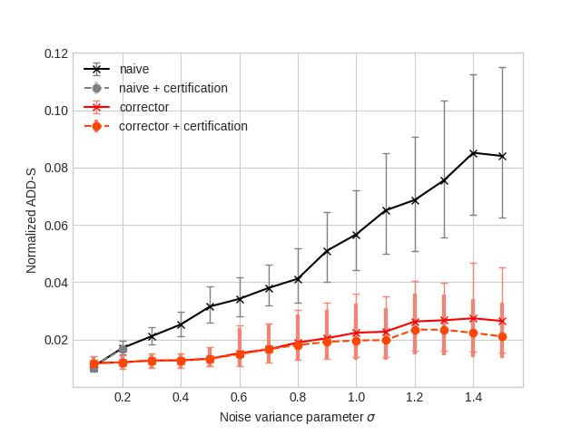
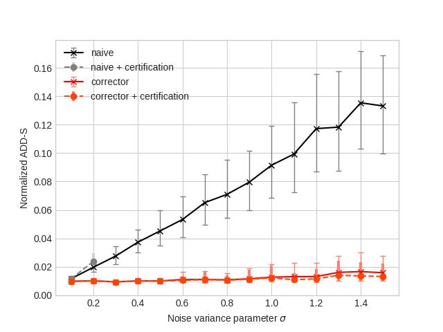

# Certifiable 3D Object Pose Estimation 

Authors: Rajat Talak and Lisa Peng

This is an open-source implementation of our paper: 
"*Certifiable 3D Object Pose Estimation: Foundations, Learning Models, and Self-Training*".
This repository helps reproduce the experimental results reported in the paper and provides trained models for use.

## Paper 

Our work solves the certifiable object pose estimation problem. In it, given a partial point cloud of an object, the goal 
is to estimate the object pose and provide certification guarantees.

#### R. Talak, L. Peng, L. Carlone, Certifiable 3D Object Pose Estimation: Foundations, Learning Models, and Self-Training, January 2023 [[arXiv](https://arxiv.org/abs/2206.11215)]

**Abstract:** We consider a *certifiable* object pose estimation problem, where 
---given a partial point cloud of an object--- the goal is to not only estimate the object pose, but 
also to provide a certificate of correctness for the resulting estimate.
Our first contribution is a general theory of certification for end-to-end perception models. 
In particular, we introduce the notion of $\zeta$-*correctness*, which bounds the  distance between an 
estimate and the ground truth.
We then show that $\zeta$-*correctness* can be assessed by implementing two certificates: 
(i) a certificate of *observable correctness*, 
that asserts if the model output is consistent with the input data and prior information, 
(ii) a certificate of *non-degeneracy*, that asserts whether the input data is sufficient to compute a unique estimate.
Our second contribution is to apply this theory and design a new learning-based certifiable pose estimator.
In particular, we propose C-3PO, a semantic-keypoint-based pose estimation model, augmented with the two certificates, 
to solve the certifiable pose estimation problem.
C-3PO also includes a *keypoint corrector*, implemented as a differentiable optimization 
layer, that can correct large detection errors (\eg due to the sim-to-real gap). 
Our third contribution is a novel self-supervised training approach that uses our 
certificate of observable correctness to provide the supervisory signal to C-3PO during training.
In it, the model trains only on the observably correct input-output pairs produced in each batch and at each 
iteration. As training progresses, we see that the observably correct input-output pairs grow, 
eventually reaching near 100% in many cases. 
We conduct extensive experiments to evaluate the performance of the corrector, 
the certification, and the proposed self-supervised training using the ShapeNet and YCB datasets. 
The experiments show that (i) standard semantic-keypoint-based methods (which constitute the backbone of C-3PO) 
outperform more recent alternatives in challenging problem instances, (ii) C-3PO further improves performance 
and significantly outperforms all the baselines, (iii) C-3PO's certificates are able to discern correct pose estimates.
We release the implementation and an interactive visualization of all the results presented 
in this paper at: https://github.com/MIT-SPARK/C-3PO and https://github.com/MIT-SPARK/pose-baselines.

If you find this repository useful, do cite our work:

```bibtex
@article{Talak23arxiv-c3po,
  title = {Certifiable 3D Object Pose Estimation: Foundations, Learning Models, and Self-Training},
  author = {Talak, Rajat and Peng, Lisa and Carlone, Luca},
  year = {2023},
  month = {Jan.},
  journal = {arXiv preprint arXiv: 2206.11215},
  eprint = {2206.11215},
  note = {\linkToPdf{https://arxiv.org/pdf/2206.11215.pdf}},
  pdf={https://arxiv.org/pdf/2206.11215.pdf},
  Year = {2023}
}

```


## Installation 

Clone the repository and install a conda environment from the yml file:
```bash
git clone --depth 1 https://github.com/MIT-SPARK/C-3PO.git 
cd C-3PO/
conda env create -f environment.yml
conda activate c3po
```
Setup the repository with dataset and downloaded pre-trained models. See instructions [here](docs/repository-setup.md)

## Experiments

### Data Analysis
This analysis is to show the distribution of pose transformation error --namely, rotation and translation error-- 
induced in the pose estimation dataset. The performance of several baselines critically depend on this distribution.

To see this distribution:
```bash
cd results/data_analysis
jupyter notebook data_analysis.ipynb
```

### Keypoint Corrector Analysis

#### Description 
This experiment aims to show the effectiveness of our keypoint corrector module. It uses ShapeNet dataset models. 
For each input point cloud, we perturb 80% of the the keypoints with varying amounts of noise and then pass the 
input through the corrector module and then the registration module. Averaged ADD-S errors for 100 iterations of 
the corrector forward pass per noise variance parameter are saved for plot generation. 

#### Replication
[//]: # (To replicate our results do the following. )
To generate plots from the saved data: 
```bash
cd results/expt_corrector
jupyter notebook results.ipynb
```

To re-run the experiment and save performance metrics for plot generation:
```bash
cd scripts/expt_corrector
bash analyze.sh
```


[//]: # (||||)

[//]: # (|:---:|:---:|:---:|)

[//]: # (| corrector results on table model | corrector results on vessel model | corrector results on skateboard model |)

[//]: # ()

### The ShapeNet Experiment

#### Description 
This experiment shows the success of the proposed self-supervised training on a dataset of simulated depth point clouds 
using ShapeNet models. We are able to generate data across various object categories in ShapeNet and show the power 
of our proposed model in matching a supervised baseline, without using any annotation on the generated training data.

#### Replication
[//]: # (The proposed model requires one to specify the object category and the architecture used for the keypoint detector. We show how to train and evaluate the proposed model for **object**: *chair* and **keypoint detector**: *point transformer*. )

Trained and evaluated models are saved in the repository. Visualize the results by:
```bash
cd results/expt_shapenet_ycb
jupyter notebook results.ipynb
```

Evaluate the trained models with:
```bash
cd scripts/expt_shapenet
bash evaluate_real.sh
bash evaluate_sim.sh 
```

For training models see instructions [here](docs/training-models.md).


### The YCB Experiment 

#### Description 
This experiment shows that the proposed self-supervised training method also works on a real-world dataset comprised of 
RGB-D images. We see that the proposed model -- after self-supervised training -- is able to match or exceed the 
performance of a supervised baseline, without using any annotations for training.

#### Replication
[//]: # (The proposed model requires one to specify the object category and the architecture used for the keypoint detector. We show how to train and evaluate the proposed model for **object**: *002\_master\_chef\_can* and **keypoint detector**: *point transformer*. )

Trained and evaluated models are saved in the repository. Visualize the results by:
```bash
cd results/expt_shapenet_ycb
jupyter notebook results.ipynb
```

Evaluate the trained models with:
```bash
cd scripts/expt_ycb
bash evaluate.sh
```
For training models see instructions [here](docs/training-models.md).


### Learning without Object Category Labels 

#### Description
The proposed self-supervised training works even when the unannotated data does not have category labels.
This experiment validates it. 

#### Replication
Trained and evaluated models are saved in the repository. Visualize the results by: 
```bash
cd results/expt_categoryless
jupyter notebook results.ipynb
```

Evaluate the trained models with:
```bash
cd scripts/expt_categoryless
bash evaluate_shapenet.sh
bash evaluate_ycb.sh
```

For training models see instructions [here](docs/training-models.md).


### Corrector Compute Time Analysis
We implement a constant step size batch gradient descent to solve the corrector optimization problem in the forward pass. 
We show that this results in faster forward compute time, in training. The analysis here validates it.

To plot the results, run:
```bash
cd results/expt_compute
bash plot.sh
```

To analyze (again, for yourself) the compute time --i.e. the time to solve the corrector optimization problem-- per data point in a batch,
as a function of the batch size, run:
```bash
cd scripts/expt_compute
bash analyze.sh
```


## License
Our C-3PO project is released under MIT license.


## Acknowledgement
This work was partially funded by ARL DCIST CRA W911NF-17-2-0181, ONR RAIDER N00014-18-1-2828, and NSF CAREER award 
"Certifiable Perception for Autonomous Cyber-Physical Systems".
