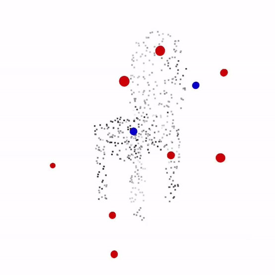

# Correct and Certify: A New Approach to Self-Supervised 3D Object Perception

**Authors:** [Rajat Talak](https://www.rajattalak.com/){:target="_blank"}, Lisa Peng, [Luca Carlone](https://lucacarlone.mit.edu/)


## About

This is **C-3PO** -- an open-source implementation of our work titled "*Correct and Certify: A New Approach to Self-Supervised 3D Object Perception*" (see [paper](#paper)).
**C-3PO** solves the certifiable object pose estimation problem, where -- given a partial point cloud of an object -- the goal is to estimate the object pose, fit a CAD model to the sensor data, and provide certification guarantees. 


**C-3PO** uses a semantic keypoint-based pose estimation model, that is initially trained in simulation, 
and augments it with a self-supervised training procedure on the real-data that uses:

1. **A Corrector Module** *that corrects errors in the detected keypoints (blue: detected keypoints, red: corrected keypoints)* 

	 


2. **A Certificate of Correctness** *that flags if the pose output produced by the model is correct or not (red: corrected keypoints, green: ground-truth)* 

    


3. and also predicts **A Certificate of Non-Degeneracy** *that flags if the input partial point cloud admits more than one correct pose, for a solution* 

   | Degenerate Case                                       | Non-Degenerate Case                                       |
   |-------------------------------------------------------|-----------------------------------------------------------|
   |  |  |
   | *Input exhibits multiple solutions possible*          | *Input exhibits a unique solution*                        |


**C-3PO** provides implementation of our proposed model in the [paper](#paper) and the code to reproduce the experimental results.
Our experiments rely on processed [ShapeNet](https://shapenet.org/), [KeypointNet](https://github.com/qq456cvb/KeypointNet), and the [YCB](https://www.ycbbenchmarks.com/object-models/) datasets. 
We provide the processed versions of these datasets for you to be able to reproduce and verify our results (see [datassets](#Datasets)). 


## Paper 

R. Talak, L. Peng, L. Carlone, "Correct and Certify: A New Approach to Self-Supervised 3D-Object Perception,". [arXiv:2206.11215](https://arxiv.org/abs/2206.11215) [cs.CV], Jun. 2022.

**Abstract:** We consider a certifiable object pose estimation problem, where -- given a partial point cloud of an object -- the goal is to estimate the object pose, fit a CAD model to the sensor data, and provide certification guarantees. We solve this problem by combining (i) a novel self-supervised training approach, and (ii) a certification procedure, that not only verifies whether the output produced by the model is correct or not (i.e. *certifiability*), but also flags uniqueness of the produced solution (i.e. *strong certifiability*). We use a semantic keypoint-based pose estimation model, that is initially trained in simulation and does not perform well on real-data due to the domain gap. Our self-supervised training procedure uses a *corrector* and a *certification* module to improve the detector. The corrector module corrects the detected keypoints to compensate for the domain gap, and is implemented as a declarative layer, for which we develop a simple differentiation rule. The certification module declares whether the corrected output produced by the model is certifiable (i.e. correct) or not. At each iteration, the approach optimizes over the loss induced only by the certifiable input-output pairs. As training progresses, we see that the fraction of outputs that are certifiable increases, eventually reaching near 100% in many cases. We conduct extensive experiments to evaluate the performance of the corrector, the certification, and the proposed self-supervised training using the ShapeNet and YCB datasets, and show the proposed approach achieves performance comparable to fully supervised baselines while not using any annotation for supervision on real data. 

**Citation** If you find our project useful, do not hesitate, to cite our paper.
```bibtex
@article{Talak22arxiv-correctAndCertify,
  title = {Correct and {{Certify}}: {{A New Approach}} to {{Self-Supervised 3D-Object Perception}}},
  author = {Talak, Rajat and Peng, Lisa and Carlone, Luca},
  year = {2022},
  month = {Jun.},
  journal = {arXiv preprint arXiv: 2206.11215},
  eprint = {2206.11215},
  note = {\linkToPdf{https://arxiv.org/pdf/2206.11215.pdf}},
  pdf={https://arxiv.org/pdf/2206.11215.pdf},
  Year = {2022}
}

```


## Overview and Quick Links

- [Installation](#Installation)
- [Experiments](#Experiments)
	- [Keypoint Corrector Analysis](#keypoint-corrector-analysis)
	- [The ShapeNet Experiment](#the-shapeNet-experiment)
	- [The YCB Experiment](#the-ycb-experiment)
- [Datasets](#Datasets)
- [License and Acknowledgement](#License)


## Installation 

##### Step 1: Clone C-3PO

```bash
git clone https://github.com/MIT-SPARK/C-3PO.git 
```

##### Step 2: Set up conda environment

```bash
cd C-3PO/
conda env create -f environment_learning_objects_3*.yml
```

Use the yml file that best suits your requirement. We provide two options:
| python | cuda | yml file | 
| -------| -----| -------- |
| 3.8 | 11.1 | environment_c3po_38.yml |
| 3.9 | 10.2 | environment_c3po_39.yml |

##### Step 3: Activate the conda environment

```bash
conda activate learning-objects-00
```

##### Step 4: Install C-3PO

```bash
python setup.py develop
```

Verify that the following libraries are installed: `cudatoolkit`, `pytorch`, `pytorch-geometric`, `fvcore`, `iopath`, `bottler`, `pytorch3d`, `scipy`, `yaml`, and `open3d` 


## Experiments

### Keypoint Corrector Analysis

**Description.** This experiment aims to show the effectiveness of our keypoint corrector module. It uses ShapeNet dataset models. For each input point cloud, we perturb 80% of the the keypoints with varying amounts of noise and then pass the input through the corrector module and then the registration module. Averaged ADD-S errors for 100 iterations of the corrector forward pass per noise variance parameter are saved for plot generation. 

**Location.** `c3po/expt_keypoint_corrector_analysis/` 


% Add Figure


**Results.** Our analysis plots are saved in: `c3po/expt_keypoint_corrector_analysis/expt_with_reg_depthpc/<CLASS_ID>/<MODEL_ID>_wchamfer/`

**Replication.** To replicate our results do the following. 

1. Run the experiment and save performance metrics for plot generation.
	```bash 
	cd c3po/expt_keypoint_corrector_analysis/
	python expt_with_reg_depthpc.py
	```
	
	The generated performance metrics will be saved in the following pickle file.
	`c3po/expt_keypoint_corrector_analysis/expt_with_reg_depthpc/<CLASS_ID>/<MODEL_ID>_wchamfer/<TIMESTAMP>_experiment.pickle`


2. Generate plots from the saved pickle file. 
	
	To regenerate plots, change the `file_names` parameter inside `expt_with_reg_depthpc_analyze.py` to the pickle filepath containing saved metrics from the previous step, and run `python expt_with_reg_depthpc_analyze.py`


### The ShapeNet Experiment

This experiment shows the success of the proposed self-supervised training on a dataset of generated depth point clouds using ShapeNet models. We are able to generate data across various object categories in ShapeNet and show the power of our proposed model, in matching a supervised baseline, without using any annotation on the generated, training data.

**Replication.** The proposed model requires one to specify the object category and the architecture used to implement the keypoint detector. We show how to train and evaluate the proposed model for **object**: *chair* and **keypoint detector**: *point transformer*. 

1. Move to the ShapeNet experiment directory:
    ```bash 
       cd c3po/expt_shapenet/
    ```

2. Trained models are saved in the repo. To evaluate the trained models, run:
    ```bash
       python evaluate_proposed_model.py "point_transformer" "chair" "post" 
    ```
   *Note: argument "post" asks it to evaluate the model that is trained (self-superviised) on the real-data. Changing it to "pre" will evaluate the simulation-trained model on real-world data.*


2. To run self-supervised training: 
   ```bash
      python training.py "point_transformer" "chair" "self_supervised"
   ```
    *Note: this will overwrite the trained and saved model.*


3. To run the supervised training on simulated data:
    ```bash
       python training.py "point_transformer" "chair" "supervised"
    ```
   *Note: this will overwrite the trained and saved model.* 


### The YCB Experiment 

This experiment shows that the proposed self-supervised training method also works on real-world dataset such as RGB-D images. We see that the proposed model -- after self-supervised training -- is able to match or exceed the performance of a supervised baseline, without using any annotation for training.

**Replication**

1. Trained models are saved in the repo. To evaluate the trained models, run:
	```bash
	
	```
2.  


## Datasets

Our experiments rely on  the [ShapeNet](https://shapenet.org/), [KeypointNet](https://github.com/qq456cvb/KeypointNet), and the [YCB](https://www.ycbbenchmarks.com/object-models/) datasets. Please view ShapeNet's terms of use [here](https://shapenet.org/terms). 

There's no need to download the datasets seperately. Our experiments use a processed version of these datasets. Follow the steps below to download and save the relevant dataset. 

1. Download our processed dataset files on Google Drive [here](https://drive.google.com/drive/folders/1IPHZ-KiuT42ugZQ27-CZuiZfvy5LLvIa?usp=sharing) and move all the files to the same directory this README is in (the C3PO repo). We've provided the dataset as a zip archive split into 1GB chunks of the format ```c3po-data.z**```.

2. Combine the archives into one zip file: 
	```bash 
	zip -F c3po-data.zip --out data.zip
	```

3. Unzip the file:
	```bash
	unzip data.zip
	```

4. Verify your directory structure looks as follows:
	```
	C3PO
	│   README.md
	│   c3po   
	│   setup.py
	└───data
	│   │   learning-objects
	│   |   └───...
	│   │
	│   │   KeypointNet
	│   |   └───...
	│   │
	│   └───ycb
	│       │   models
	│       └───...
	│   
	└───...
	```


## License
Our C-3PO project is released under MIT license.


## Acknowledgement
This work was partially funded by ARL DCIST CRA W911NF-17-2-0181, ONR RAIDER N00014-18-1-2828, and NSF CAREER award "Certifiable Perception for Autonomous Cyber-Physical Systems".
